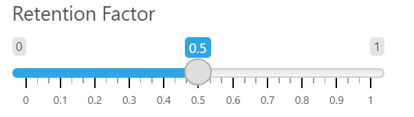
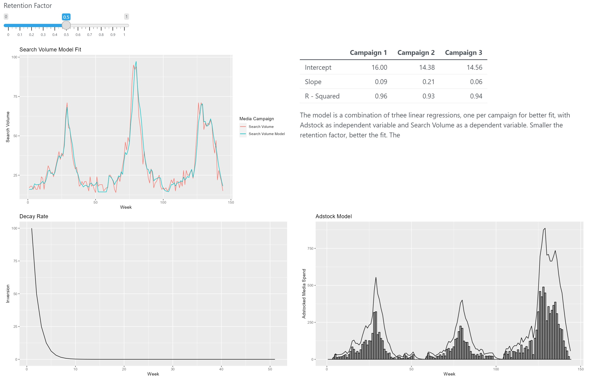
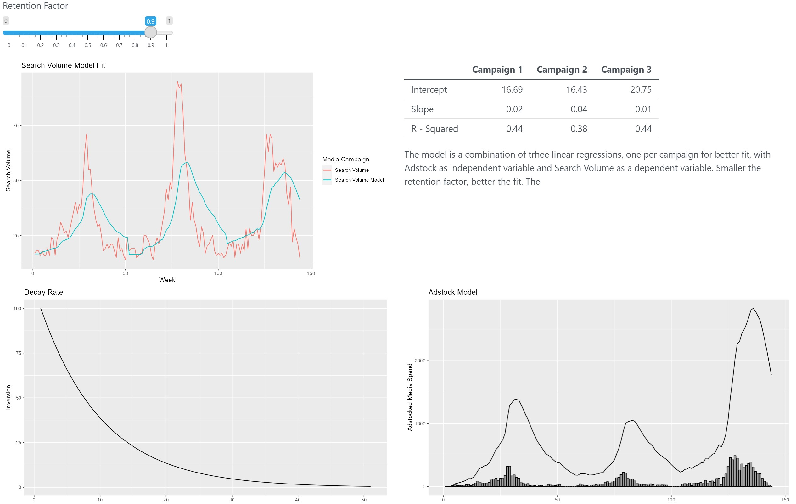

---
title: "Documentation - Kantar Recruitment Exercise - Luisa Márquez Rentería"
output: rmarkdown::html_vignette
---

```{r, echo=FALSE}
library(png)
library(knitr)
```

## 1. Introducción

The Simple Decay Model is a way of transforming the sales response of a product or service to account for the advertising carryover effect. This effect means that the exposure to advertising builds up over time and increases the awareness and preference of consumers. The formula is 

$$Adstock_{t} = S_{t} + [RF * Adstock_{t-1}]$$

where $t$ is a determine week, $S$ is the spend in USD and $RF \in [0,1]$ is the Retention Factor describing the proportion of the media pressure that is carried over from week to week.

The retention factor measures how much of the publicity is retained in time. A higher retention factor means a lower decay rate, which measures the sales decline after each exposure to advertising. A higher decay rate means that the sales drop more quickly, while a lower decay rate means that the sales drop more slowly. 

The model can be used to estimate the impact of advertising on searches in linear model, such as regression. However, this model has some limitations, such as ignoring the nonlinear effects of advertising exposure, assuming constant exposure rates, and not accounting for other factors that may affect sales, such as price or competition.


## 2. Model

The aim is to gain an understanding of how a brand’s advertising spend has influenced the levels of weekly Google Search volumes. The advertising has specifically intended to increase in Search volumes and over time three different (non-overlapping) advertising campaigns have been used. 
 
First, an exploratory analysis that review the spend per dollar has been done to the data.

Secondly, the Simple Decay Model is applied per campaign to get the adstock per week. In this step, the adstock model is compared with media spend for different retention factors.

Then, to estimate the impact of advertising on searches, the $lm$ function in R is used. This is a tool for fitting linear models. It can be used to perform various types of regression analysis, such as simple, multiple, logistic, or generalized linear models. The $lm$ function has the basic syntax:


$$lm(formula, data,...)$$

Where:

(-) formula: A symbolic description of the model to be fitted. It can include one or more predictor variables and a response variable. For example: $y \thicksim x1+x2+x3$

(-) data: An optional data frame that contains the variable in the model. If not specified, the variables are taken from the environment where the $lm$ function is called.

With Adstock as independent variable and Search Volume as a dependent variable, the $lm$ model took the form:

$$lm(Search Volume \thicksim Adstock, data = campaing)$$
Which is applied per campaign. 
 
## 3. Shiny

This shiny uses a .csv file directly on top of the code. It is not necessary to upload any files to shiny.

### 3.1 Slider

At the top of the page there is a slider that goes from 0 to 1, whose function is to modify the retention factor

```{r  out.width = "100%", echo=FALSE}
 
```

This will modify the adstock model and, in consequence, the serch volume model:

```{r  out.width = "100%", echo=FALSE}

 
```

### 3.2 Results

First there is a graph with title "Search Volume Model Fit" that compares the original Search Volume with the predicted Search Volume, besides it there is a table with the values of intercept, slop and R squared for each campaign. 

Then, to visualize the adstock motdel, is the Decay Rate graph and the Adstock Model / Spend graph.

Finally, there is a graph and table to see the searches per dollar and campaign.
